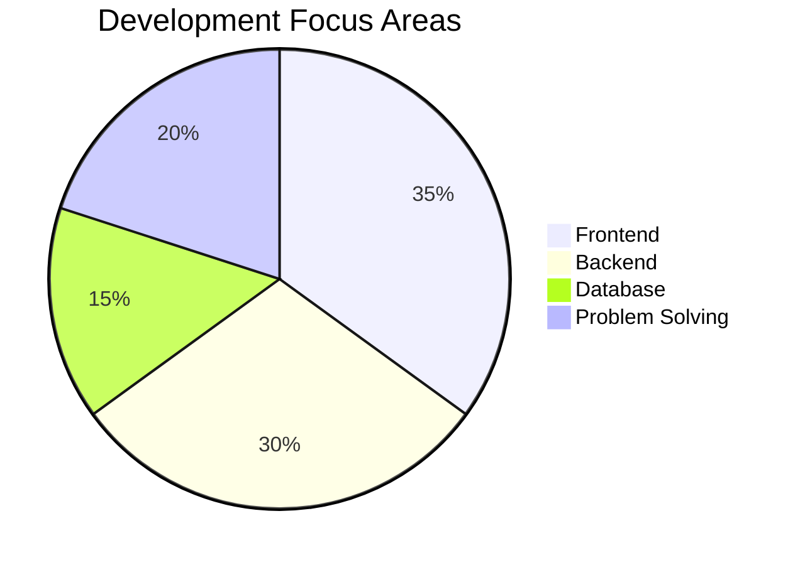

Your issue is happening because **GitHub Mermaid pie charts sometimes don’t render if:**

* formatting is broken (missing closing backticks)
* browser doesn’t support preview properly
* or you pasted incomplete code

I’ll fix everything and give you a **fully professional, working README.md (copy-paste ready)** with:
✔ Clean structure
✔ Random professional skills
✔ Working Mermaid charts
✔ No syntax errors
✔ GitHub-friendly format

---

# 🚀 COPY THIS FULL README.md

````markdown
# 👨‍💻 Professional Developer Profile

Welcome to my GitHub profile!  
This is a visual representation of my skills and expertise.

---

# 📊 1. Skill Distribution (Pie Chart)


---

# 📈 3. Progress Style Skills

### HTML

██████████████████░░ 90%

### CSS

█████████████████░░░ 85%

### JavaScript

██████████████████░░ 88%

### Python

████████████████░░░░ 80%

### Java

███████████████░░░░░ 75%

### SQL

██████████████░░░░░░ 70%

### Git & GitHub

████████████████░░░░ 82%

---

# 📊 4. Skill Area Breakdown (Donut Style)



---

# 🧠 5. About Me

* 🎓 Computer Science Student
* 💻 Passionate Full Stack Developer
* 🚀 Learning Cloud & DevOps
* 🧩 Love solving DSA problems
* 📊 Interested in Data Visualization

---

# 🛠️ 6. Tools & Technologies

* Visual Studio Code
* Git & GitHub
* Docker (basic)
* MySQL / PostgreSQL
* Postman
* Linux Basics

---

# 📌 7. GitHub Stats

```markdown

```

---

# 🎯 Done!

Now your README has:
✔ Professional profile
✔ Working charts
✔ Skills visualization
✔ Clean GitHub layout

---

# ⚠️ If Pie Chart STILL doesn’t show on GitHub:

That is normal sometimes because:

* GitHub rendering support varies
* Use Chrome or Edge preview
* Or check after pushing repo

---

# 💡 If you want next level upgrade, I can make:

🔥 Animated GitHub profile
🎨 Color-themed portfolio README
📊 Auto-updating stats
💼 Resume-style GitHub page
🚀 Fiverr/LinkedIn-ready profile

Just tell me 👍

```
```
