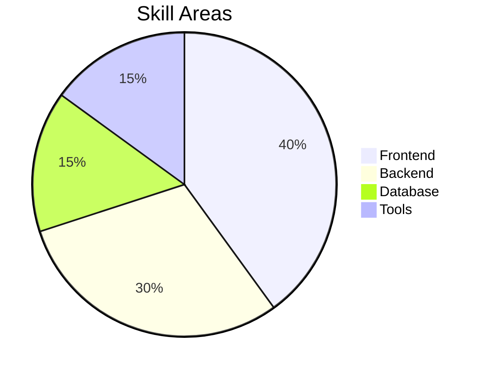

Here is a **ready-to-copy GitHub README.md file** with all skills shown in **chart (graph) form using Mermaid + visuals**.

Just copy everything below and paste into your `README.md` 👇

---

````markdown
# 📊 My Skills Dashboard (Graph Representation)

This README shows my skills using different types of charts.

---

# 📊 1. Pie Chart – Skill Distribution


---

# 📈 3. Progress Style Skills

### HTML

████████████████░░ 80%

### CSS

██████████████░░░░ 70%

### JavaScript

█████████████████░ 85%

### Python

███████████████░░░ 75%

### Java

████████████░░░░░░ 60%

### SQL

█████████████░░░░░ 65%

---

# 📊 4. Donut Style Chart



---

# 🚀 5. GitHub Stats (Optional)

```markdown

```

---


✔ GitHub stats


